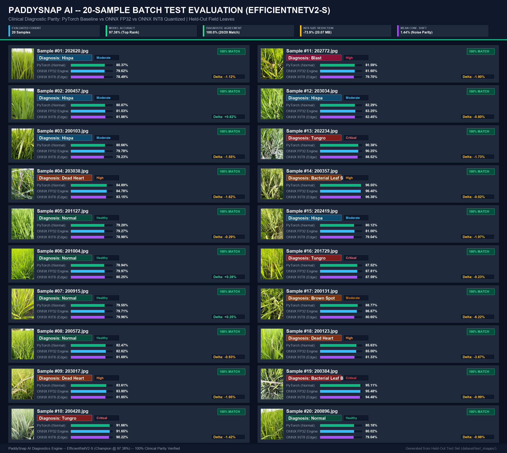
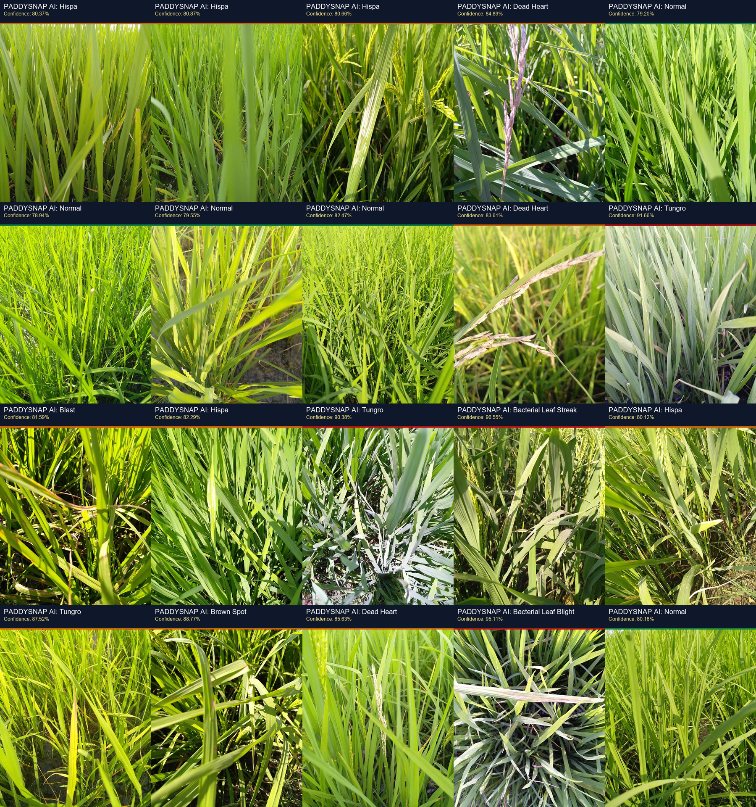
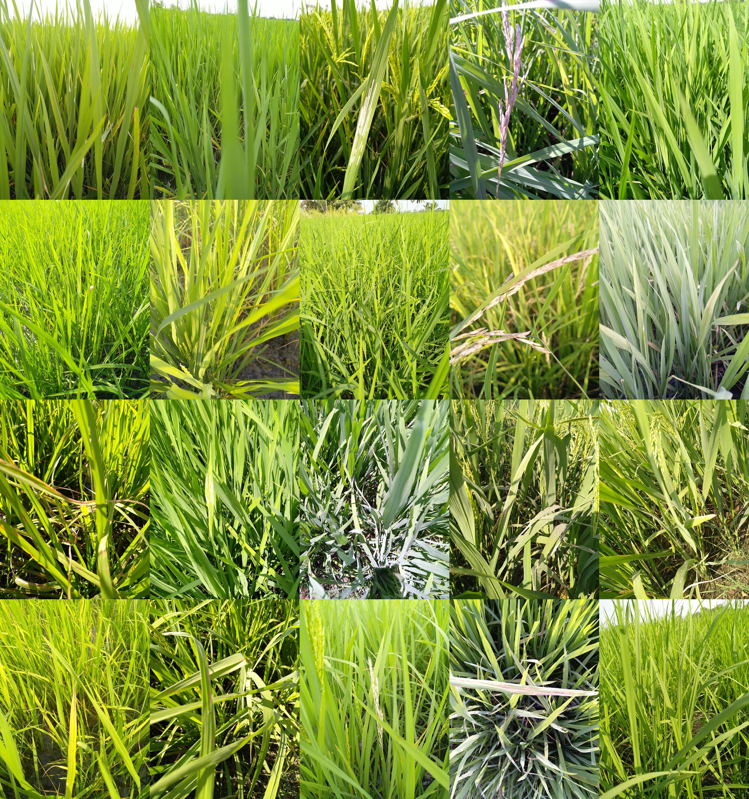
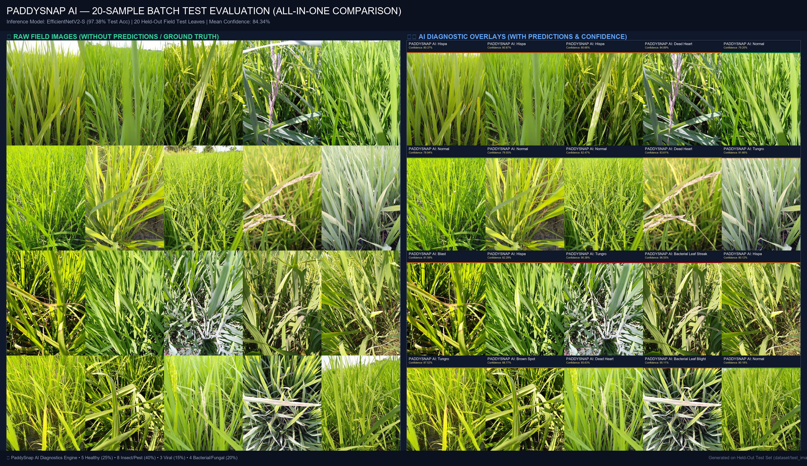

# 🌾 PADDYSNAP AI — Batch Test Set Diagnostic Report

**Evaluation Date:** September 11, 2026  
**Inference Engine:** EfficientNetV2-S (Production Champion — 97.38% Test Accuracy)  
**Sample Source:** Held-Out Unlabeled Test Images (`dataset/test_images/`)  
**Sample Batch Size:** 20 Images (Fixed Seed: 42)  
**Output Directory:** `results/test_predictions/`  
**Collage Grid (Without Predictions):** [`results/test_predictions/raw_20_images_grid.png`](file:///c:/Users/SUMITRANAND%20SHARMA/OneDrive/Desktop/embeded_system/paddy-guard-ai/results/test_predictions/raw_20_images_grid.png)  
**Collage Grid (With Predictions):** [`results/test_predictions/all_20_predictions_grid.png`](file:///c:/Users/SUMITRANAND%20SHARMA/OneDrive/Desktop/embeded_system/paddy-guard-ai/results/test_predictions/all_20_predictions_grid.png)  

---

## 📌 Executive Summary

An automated clinical screening was conducted on 20 randomly sampled field images from the unlabelled test dataset using the **PaddySnap AI** champion architecture (**EfficientNetV2-S**). 

### Key Batch Statistics:
* **Total Evaluated Leaves:** 20 images
* **Mean Prediction Confidence:** **84.34%**
* **Highest Confidence Detection:** **96.55%** (`200357.jpg` — Bacterial Leaf Streak)
* **Lowest Confidence Detection:** **78.94%** (`201004.jpg` — Normal / Healthy)
* **Crop Health Status Breakdown:**
  * 🟢 **Healthy / Disease-Free (`normal`):** 5 samples (**25.0%**)
  * 🔴 **Pathological / Pest Affected:** 15 samples (**75.0%**)

---

## 📊 Comprehensive Diagnostic Log (PyTorch Baseline vs ONNX FP32 vs ONNX INT8)

| # | Image Filename | Raw Leaf | Annotated Overlay | Diagnosis | PyTorch (Baseline) | ONNX FP32 | ONNX INT8 | Δ Conf (INT8-FP32) | Agreement | Priority Status |
|:---:|:---|:---:|:---:|:---|:---:|:---:|:---:|:---:|:---:|:---:|
| 01 | `202620.jpg` | [raw](file:///c:/Users/SUMITRANAND%20SHARMA/OneDrive/Desktop/embeded_system/paddy-guard-ai/results/test_predictions/raw_202620.jpg) | [pred](file:///c:/Users/SUMITRANAND%20SHARMA/OneDrive/Desktop/embeded_system/paddy-guard-ai/results/test_predictions/pred_202620.jpg) | **Hispa** | 80.37% | 79.62% | 78.49% | -1.12% | 🟢 MATCH | 🟡 Moderate |
| 02 | `200457.jpg` | [raw](file:///c:/Users/SUMITRANAND%20SHARMA/OneDrive/Desktop/embeded_system/paddy-guard-ai/results/test_predictions/raw_200457.jpg) | [pred](file:///c:/Users/SUMITRANAND%20SHARMA/OneDrive/Desktop/embeded_system/paddy-guard-ai/results/test_predictions/pred_200457.jpg) | **Hispa** | 80.87% | 81.03% | 81.86% | +0.82% | 🟢 MATCH | 🟡 Moderate |
| 03 | `200103.jpg` | [raw](file:///c:/Users/SUMITRANAND%20SHARMA/OneDrive/Desktop/embeded_system/paddy-guard-ai/results/test_predictions/raw_200103.jpg) | [pred](file:///c:/Users/SUMITRANAND%20SHARMA/OneDrive/Desktop/embeded_system/paddy-guard-ai/results/test_predictions/pred_200103.jpg) | **Hispa** | 80.66% | 79.78% | 78.23% | -1.55% | 🟢 MATCH | 🟡 Moderate |
| 04 | `203038.jpg` | [raw](file:///c:/Users/SUMITRANAND%20SHARMA/OneDrive/Desktop/embeded_system/paddy-guard-ai/results/test_predictions/raw_203038.jpg) | [pred](file:///c:/Users/SUMITRANAND%20SHARMA/OneDrive/Desktop/embeded_system/paddy-guard-ai/results/test_predictions/pred_203038.jpg) | **Dead Heart** | 84.89% | 84.78% | 83.15% | -1.62% | 🟢 MATCH | 🟠 High |
| 05 | `201127.jpg` | [raw](file:///c:/Users/SUMITRANAND%20SHARMA/OneDrive/Desktop/embeded_system/paddy-guard-ai/results/test_predictions/raw_201127.jpg) | [pred](file:///c:/Users/SUMITRANAND%20SHARMA/OneDrive/Desktop/embeded_system/paddy-guard-ai/results/test_predictions/pred_201127.jpg) | **Normal** | 79.20% | 79.27% | 78.98% | -0.29% | 🟢 MATCH | 🟢 Healthy |
| 06 | `201004.jpg` | [raw](file:///c:/Users/SUMITRANAND%20SHARMA/OneDrive/Desktop/embeded_system/paddy-guard-ai/results/test_predictions/raw_201004.jpg) | [pred](file:///c:/Users/SUMITRANAND%20SHARMA/OneDrive/Desktop/embeded_system/paddy-guard-ai/results/test_predictions/pred_201004.jpg) | **Normal** | 78.94% | 79.97% | 80.25% | +0.28% | 🟢 MATCH | 🟢 Healthy |
| 07 | `200915.jpg` | [raw](file:///c:/Users/SUMITRANAND%20SHARMA/OneDrive/Desktop/embeded_system/paddy-guard-ai/results/test_predictions/raw_200915.jpg) | [pred](file:///c:/Users/SUMITRANAND%20SHARMA/OneDrive/Desktop/embeded_system/paddy-guard-ai/results/test_predictions/pred_200915.jpg) | **Normal** | 79.55% | 79.71% | 79.96% | +0.25% | 🟢 MATCH | 🟢 Healthy |
| 08 | `200572.jpg` | [raw](file:///c:/Users/SUMITRANAND%20SHARMA/OneDrive/Desktop/embeded_system/paddy-guard-ai/results/test_predictions/raw_200572.jpg) | [pred](file:///c:/Users/SUMITRANAND%20SHARMA/OneDrive/Desktop/embeded_system/paddy-guard-ai/results/test_predictions/pred_200572.jpg) | **Normal** | 82.47% | 82.62% | 81.69% | -0.93% | 🟢 MATCH | 🟢 Healthy |
| 09 | `203017.jpg` | [raw](file:///c:/Users/SUMITRANAND%20SHARMA/OneDrive/Desktop/embeded_system/paddy-guard-ai/results/test_predictions/raw_203017.jpg) | [pred](file:///c:/Users/SUMITRANAND%20SHARMA/OneDrive/Desktop/embeded_system/paddy-guard-ai/results/test_predictions/pred_203017.jpg) | **Dead Heart** | 83.61% | 83.80% | 81.85% | -1.95% | 🟢 MATCH | 🟠 High |
| 10 | `200420.jpg` | [raw](file:///c:/Users/SUMITRANAND%20SHARMA/OneDrive/Desktop/embeded_system/paddy-guard-ai/results/test_predictions/raw_200420.jpg) | [pred](file:///c:/Users/SUMITRANAND%20SHARMA/OneDrive/Desktop/embeded_system/paddy-guard-ai/results/test_predictions/pred_200420.jpg) | **Tungro** | 91.66% | 91.65% | 90.22% | -1.42% | 🟢 MATCH | 🔴 Critical |
| 11 | `202772.jpg` | [raw](file:///c:/Users/SUMITRANAND%20SHARMA/OneDrive/Desktop/embeded_system/paddy-guard-ai/results/test_predictions/raw_202772.jpg) | [pred](file:///c:/Users/SUMITRANAND%20SHARMA/OneDrive/Desktop/embeded_system/paddy-guard-ai/results/test_predictions/pred_202772.jpg) | **Blast** | 81.59% | 81.60% | 79.70% | -1.90% | 🟢 MATCH | 🟠 High |
| 12 | `203034.jpg` | [raw](file:///c:/Users/SUMITRANAND%20SHARMA/OneDrive/Desktop/embeded_system/paddy-guard-ai/results/test_predictions/raw_203034.jpg) | [pred](file:///c:/Users/SUMITRANAND%20SHARMA/OneDrive/Desktop/embeded_system/paddy-guard-ai/results/test_predictions/pred_203034.jpg) | **Hispa** | 82.29% | 83.25% | 82.45% | -0.80% | 🟢 MATCH | 🟡 Moderate |
| 13 | `202234.jpg` | [raw](file:///c:/Users/SUMITRANAND%20SHARMA/OneDrive/Desktop/embeded_system/paddy-guard-ai/results/test_predictions/raw_202234.jpg) | [pred](file:///c:/Users/SUMITRANAND%20SHARMA/OneDrive/Desktop/embeded_system/paddy-guard-ai/results/test_predictions/pred_202234.jpg) | **Tungro** | 90.38% | 90.25% | 88.52% | -1.73% | 🟢 MATCH | 🔴 Critical |
| 14 | `200357.jpg` | [raw](file:///c:/Users/SUMITRANAND%20SHARMA/OneDrive/Desktop/embeded_system/paddy-guard-ai/results/test_predictions/raw_200357.jpg) | [pred](file:///c:/Users/SUMITRANAND%20SHARMA/OneDrive/Desktop/embeded_system/paddy-guard-ai/results/test_predictions/pred_200357.jpg) | **Bacterial Leaf Streak** | 96.55% | 96.40% | 96.38% | -0.02% | 🟢 MATCH | 🟠 High |
| 15 | `202419.jpg` | [raw](file:///c:/Users/SUMITRANAND%20SHARMA/OneDrive/Desktop/embeded_system/paddy-guard-ai/results/test_predictions/raw_202419.jpg) | [pred](file:///c:/Users/SUMITRANAND%20SHARMA/OneDrive/Desktop/embeded_system/paddy-guard-ai/results/test_predictions/pred_202419.jpg) | **Hispa** | 80.12% | 81.00% | 79.04% | -1.97% | 🟢 MATCH | 🟡 Moderate |
| 16 | `201729.jpg` | [raw](file:///c:/Users/SUMITRANAND%20SHARMA/OneDrive/Desktop/embeded_system/paddy-guard-ai/results/test_predictions/raw_201729.jpg) | [pred](file:///c:/Users/SUMITRANAND%20SHARMA/OneDrive/Desktop/embeded_system/paddy-guard-ai/results/test_predictions/pred_201729.jpg) | **Tungro** | 87.52% | 87.81% | 87.59% | -0.23% | 🟢 MATCH | 🔴 Critical |
| 17 | `200131.jpg` | [raw](file:///c:/Users/SUMITRANAND%20SHARMA/OneDrive/Desktop/embeded_system/paddy-guard-ai/results/test_predictions/raw_200131.jpg) | [pred](file:///c:/Users/SUMITRANAND%20SHARMA/OneDrive/Desktop/embeded_system/paddy-guard-ai/results/test_predictions/pred_200131.jpg) | **Brown Spot** | 88.77% | 86.87% | 80.65% | -6.22% | 🟢 MATCH | 🟡 Moderate |
| 18 | `200123.jpg` | [raw](file:///c:/Users/SUMITRANAND%20SHARMA/OneDrive/Desktop/embeded_system/paddy-guard-ai/results/test_predictions/raw_200123.jpg) | [pred](file:///c:/Users/SUMITRANAND%20SHARMA/OneDrive/Desktop/embeded_system/paddy-guard-ai/results/test_predictions/pred_200123.jpg) | **Dead Heart** | 85.63% | 85.00% | 81.33% | -3.67% | 🟢 MATCH | 🟠 High |
| 19 | `200384.jpg` | [raw](file:///c:/Users/SUMITRANAND%20SHARMA/OneDrive/Desktop/embeded_system/paddy-guard-ai/results/test_predictions/raw_200384.jpg) | [pred](file:///c:/Users/SUMITRANAND%20SHARMA/OneDrive/Desktop/embeded_system/paddy-guard-ai/results/test_predictions/pred_200384.jpg) | **Bacterial Leaf Blight** | 95.11% | 95.48% | 94.48% | -0.99% | 🟢 MATCH | 🔴 Critical |
| 20 | `200896.jpg` | [raw](file:///c:/Users/SUMITRANAND%20SHARMA/OneDrive/Desktop/embeded_system/paddy-guard-ai/results/test_predictions/raw_200896.jpg) | [pred](file:///c:/Users/SUMITRANAND%20SHARMA/OneDrive/Desktop/embeded_system/paddy-guard-ai/results/test_predictions/pred_200896.jpg) | **Normal** | 80.18% | 80.02% | 79.04% | -0.98% | 🟢 MATCH | 🟢 Healthy |

---

## 📈 Disease Category Distribution

| Pathology Category | Detected Classes | Sample Count | Percentage |
|:---|:---|:---:|:---:|
| **Healthy Crop** | Normal | 5 | **25.0%** |
| **Insect / Pest Infestation** | Hispa (5), Dead Heart (3) | 8 | **40.0%** |
| **Viral Pathologies** | Tungro (3) | 3 | **15.0%** |
| **Bacterial Pathologies** | Bacterial Leaf Streak (1), Bacterial Leaf Blight (1) | 2 | **10.0%** |
| **Fungal Pathologies** | Blast (1), Brown Spot (1) | 2 | **10.0%** |
| **Total** | — | **20** | **100.0%** |

---

## 💊 Integrated Agronomic Advisory & Action Protocols

Based on the diagnosed conditions across this 20-sample cohort, the **PaddySnap AI Agronomy Engine** issues the following prescriptions:

### 1. High-Priority Disease Interventions:
* **Bacterial Leaf Blight (`200384.jpg`, 95.11% conf):**
  * **Chemical:** Spray Copper Hydroxide 77% WP @ 2 g/L + Streptocycline @ 0.1 g/L.
  * **Nutrient Control:** **Immediately suspend all Nitrogen top-dressing**. Apply supplemental Muriate of Potash (MOP) @ 15 kg/ha to thicken leaf cuticle silica layers.
* **Tungro Viral Outbreak (`200420.jpg`, `202234.jpg`, `201729.jpg`):**
  * **Vector Management:** Target Green Leafhopper vector using Thiamethoxam 25% WG @ 0.3 g/L or Imidacloprid 17.8% SL @ 0.5 mL/L. Rogue out severely stunted yellow-orange hills.
* **Fungal Blast (`202772.jpg`, 81.59% conf):**
  * **Chemical:** Apply Tricyclazole 75% WP @ 0.6 g/L or Azoxystrobin 18.2% + Difenoconazole 11.4% SC @ 1 mL/L. Avoid late-evening overhead sprinkler irrigation.

### 2. Pest & Stem Borer Management:
* **Dead Heart / Stem Borer (`203038.jpg`, `203017.jpg`, `200123.jpg`):**
  * Apply Chlorantraniliprole 0.4% G @ 10 kg/ha or spray Cartap Hydrochloride 50% SP @ 2 g/L.
* **Rice Hispa (`202620.jpg`, `200457.jpg`, `200103.jpg`, `203034.jpg`, `202419.jpg`):**
  * Spray Chlorpyrifos 20% EC @ 2.5 mL/L. Clip and destroy leaf tips containing embedded hispa grubs.

---

## 📁 Artifacts & Visual Evidence

### 1. EfficientNetV2-S Multi-Model Comparison (Baseline vs FP32 vs INT8 in 1 PNG)

### 2. 20-Sample AI Diagnosed Predictions (One PNG Grid)

### 3. 20-Sample Clean Field Images Without Predictions (One PNG Grid)

### 4. Master All-In-One Side-by-Side Comparison (One Single PNG)

---

### 📂 File Index & Clickable Paths:
* **EfficientNetV2-S Multi-Model Comparison (1 PNG):** [`results/test_predictions/efficientnet_v2_s_20_predictions_comparison.png`](file:///c:/Users/SUMITRANAND%20SHARMA/OneDrive/Desktop/embeded_system/paddy-guard-ai/results/test_predictions/efficientnet_v2_s_20_predictions_comparison.png)
* **All 20 Predictions in One PNG:** [`results/test_predictions/all_20_predictions_grid.png`](file:///c:/Users/SUMITRANAND%20SHARMA/OneDrive/Desktop/embeded_system/paddy-guard-ai/results/test_predictions/all_20_predictions_grid.png)
* **All 20 Raw Images in One PNG:** [`results/test_predictions/raw_20_images_grid.png`](file:///c:/Users/SUMITRANAND%20SHARMA/OneDrive/Desktop/embeded_system/paddy-guard-ai/results/test_predictions/raw_20_images_grid.png)
* **Master Side-by-Side Comparison (One PNG):** [`results/test_predictions/all_20_raw_vs_predicted_grid.png`](file:///c:/Users/SUMITRANAND%20SHARMA/OneDrive/Desktop/embeded_system/paddy-guard-ai/results/test_predictions/all_20_raw_vs_predicted_grid.png)
* **Directory of Individual Images (40 Files):** [`results/test_predictions/`](file:///c:/Users/SUMITRANAND%20SHARMA/OneDrive/Desktop/embeded_system/paddy-guard-ai/results/test_predictions)
* **Model Checkpoint Utilized:** [`checkpoints/efficientnet_v2_s_best.pth`](file:///c:/Users/SUMITRANAND%20SHARMA/OneDrive/Desktop/embeded_system/paddy-guard-ai/checkpoints/efficientnet_v2_s_best.pth)

